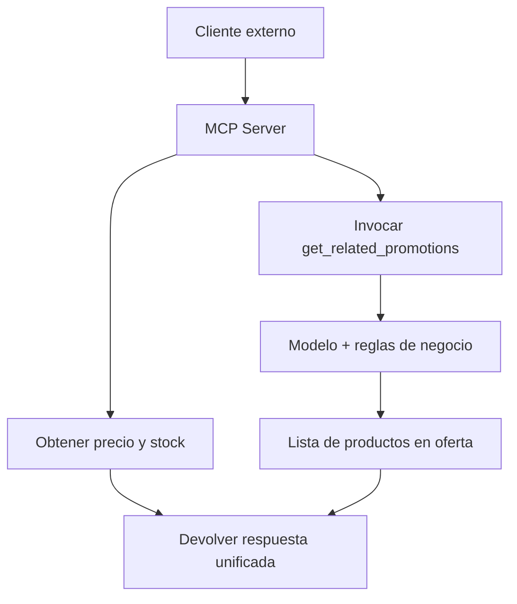

# MCP Server vs Function Calling  
### Patrones Complementarios en Sistemas de IA

**Caso de uso:** Exponer productos, precios y recomendaciones inteligentes a clientes externos

Presentado por: <b>Tu Nombre</b> – Cencosud 
Fecha: Abril 2025

---

## Slide 1: Contexto del Caso de Uso

> *Un cliente externo (ChatGPT, n8n, partner) pregunta:*  
> “¿Cuál es el precio del **Shampoo Elvive Reparación Total 5, 750ml**?  
> ¿Qué productos relacionados en oferta me recomiendan?”

**Nuestra arquitectura:**
- Un **MCP Server** recibe la consulta.
- Obtiene precio y disponibilidad.
- Invoca una **función interna** para sugerir productos en oferta.
- Devuelve todo en un formato estandarizado.

🎯 **Pregunta:**  
¿Dónde pondrías la lógica de recomendación: dentro del MCP o en una función externa?

> ✅ *Respuesta orientadora:*  
> En una **función interna**. El MCP es un adaptador, no un ejecutor. La inteligencia debe residir en sistemas bajo nuestro control.

---

## Slide 2: Flujo del Sistema

**Roles claros:**
- **MCP**: Orquesta, valida, responde.
- **Function Calling**: Ejecuta lógica compleja (recomendaciones).

🎯 **Pregunta:**  
¿Qué pasa si la función `get_related_promotions` falla? ¿Devolver solo el producto o fallar todo?

> ✅ *Respuesta orientadora:*  
> Aplica **degradación elegante**: devuelve datos esenciales (precio, stock) y marca las recomendaciones como no disponibles. No sacrifiques valor por una dependencia opcional.

---

## Slide 3: MCP Server – El Puerto de I/O

El MCP **no ejecuta lógica**, solo:
- Recibe consultas con contexto.
- Valida sintácticamente.
- Orquesta servicios internos.
- Devuelve una respuesta estandarizada.

🔧 Es como un **puerto USB**: permite conexión, pero no ejecuta el firmware del dispositivo.

🎯 **Pregunta:**  
¿Debería el MCP validar semánticamente el producto (ej: si existe), o solo actuar como pasarela?

> ✅ *Respuesta orientadora:*  
> Solo validación **sintáctica** (formato del ID). La existencia del producto debe validarse en el servicio interno. Así evitamos duplicar lógica de dominio en la capa de exposición.

---

## Slide 4: Function Calling – La Inteligencia Interna

La función `get_related_promotions(product_id)`:
- Vive en **nuestra infraestructura**.
- Usa embeddings, grafos o reglas de negocio.
- Devuelve productos relacionados **en oferta**.
- Es **monitoreable, testeable y evolutiva**.

🚀 Esta es la parte que **piensa**.

🎯 **Pregunta:**  
¿Debería esta función ser síncrona o asíncrona? ¿Qué pasa si tarda 2 segundos?

> ✅ *Respuesta orientadora:*  
> Debe ser **síncrona con timeout estricto** (ej: 800ms). En flujos de orquestación con LLMs o APIs, la latencia alta rompe la experiencia. Usa cache o modelos ligeros para cumplir SLAs.

---

## Slide 5: Comparativa Directa

| Dimensión               | MCP Server                          | Function Calling                     |
|------------------------|-------------------------------------|--------------------------------------|
| Ubicación              | Capa de exposición                  | Microservicio interno                |
| Ejecución              | Liviana, orquestación               | Pesada, con lógica                   |
| Control de código      | Parcial                             | Total                                |
| Escalabilidad          | Alta (peticiones simples)           | Variable (modelo, carga)             |
| Responsabilidad        | Contrato, formato, seguridad        | Decisión, recomendación, cálculo     |

> ✅ *"El MCP pregunta. La función piensa."*

---

## Slide 6: ¿Por qué no hacer todo en el MCP?

**Riesgos de acoplar lógica en el MCP:**
- Pérdida de encapsulamiento.
- Dificultad para testear y monitorear.
- Imposibilidad de evolucionar el modelo sin romper el contrato.
- Exposición de detalles internos (embeddings, reglas).

🎯 **Pregunta:**  
¿Qué tan peligroso es exponer lógica de negocio compleja en un endpoint público?

> ✅ *Respuesta orientadora:*  
> Muy peligroso. Aumenta la superficie de ataque, limita la evolución interna y puede filtrar información indirectamente. La lógica debe estar **detrás** del MCP, no en él.

---

## Slide 7: ¿Y por qué no usar solo Function Calling?

Si permitimos que clientes externos llamen directamente a funciones:
- Exponemos arquitectura interna.
- Rompemos encapsulamiento.
- Dificultamos el versionado y monitoreo.

🎯 **Pregunta:**  
¿En qué casos sería válido permitir Function Calling directo desde el exterior?

> ✅ *Respuesta orientadora:*  
> Solo en escenarios muy controlados (ej: partners estratégicos con contratos firmados). En general, **todo acceso externo debe pasar por una capa de abstracción** como un MCP o API Gateway.

---

## Slide 8: Diseño Robusto – Separación de Responsabilidades

**Buenas prácticas:**
- MCP: contrato claro (OpenAPI + JSON Schema).
- Función interna: con SLA, retry, circuit breaker.
- Timeout en la invocación (ej: 800ms).
- Campo opcional: `smart_recommendations`.
- Versionado independiente.

🎯 **Pregunta:**  
¿Cómo manejarías el versionado si el modelo de recomendación cambia radicalmente?

> ✅ *Respuesta orientadora:*  
> El MCP **no cambia su contrato**. Puede apuntar internamente a `recommender-v1` o `v2`. Solo si el formato de salida cambia, se versiona el MCP. La evolución interna debe ser invisible para el cliente.

---

## Slide 9: Lecciones de la Industria

Empresas como **Amazon Bedrock**, **Google Retail API** y **Stripe**:
- Exponen capacidades mediante **contratos estandarizados** (MCP-like).
- Mantienen la lógica de negocio **interna y privada**.
- Usan funciones o microservicios para inteligencia.

🎯 **Pregunta:**  
¿Deberíamos estandarizar un ‘contrato MCP’ para todos los servicios que exponemos?

> ✅ *Respuesta orientadora:*  
> Sí. Un contrato común (formato de contexto, errores, timeouts) permite interoperabilidad, consistencia y escalabilidad. Podría ser nuestro estándar interno de orquestación con LLMs e integraciones.

---

## Slide 10: Cierre – Tesis Validada

> ✅ **Tesis confirmada:**  
> *"El MCP Server es un puerto de I/O: expone, no ejecuta.  
> La Function Calling es ejecución local: piensa, decide, actúa.  
> Ambos son necesarios, distintos y complementarios."*

**Próximos pasos en Cencosud:**
1. Definir un estándar de contrato MCP.
2. Crear librería de funciones inteligentes reutilizables.
3. Hacer un POC con el caso del Shampoo Elvive.

🎯 **Última pregunta:**  
¿Qué otro dominio (logística, devoluciones, membresías) debería exponerse vía MCP con inteligencia interna?

> ✅ *Ejemplos:*  
> - Tiempo de entrega (logística externa + reglas internas).  
> - Devoluciones (política pública + historial de cliente).  
> - Ofertas personalizadas (datos externos + modelo interno).
